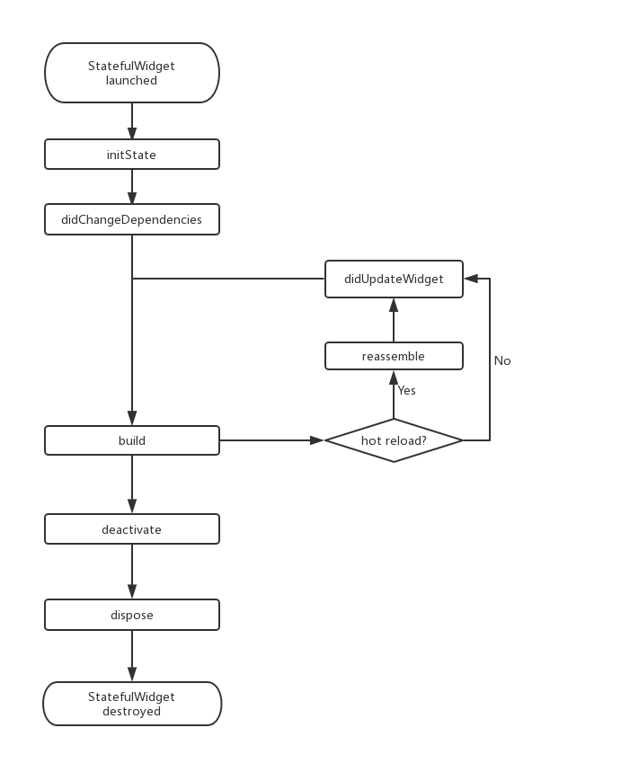

## Dart相关

### Isolate（隔离）

   在Dart VM中任何dart代码都是运行在某个isolate中的，每个isolate都是独立的，它们都有自己的存储空间、主线程和各个辅助线程，isolate之间互不影响。在Dart VM中可能同时运行着多个isolate，但它们不能直接共享数据，可以通过端口（ports：Dart VM中的一个概念，和网络中的端口不一样）相互交流信息。
   


一个isolate中主要包括以下几个部分：
1. Heap：存储dart代码运行过程中创建的所有object，并由GC（垃圾回收）线程管理。
2. 单个Mutator Thread：主线程，负责执行dart代码。
3. 多个Helper Thread：辅助线程，完成Dart VM中对isolate的一些管理(GC)、优化，等任务。

同时我们可以看到VM中有一个特殊的vm-isolate，其中保存了一些全局共享的常量数据。虽然isolate之间不能相互引用，但是每个isolate都能引用vm-isolate中保存的数据。
在这里我们再深入探讨一下isolate和OS thread的关系，实际上这是十分复杂和不确定的，因为这取决于平台特性和VM被打包进应用的方式，但是有以下三点是确定的：

1. 一个OS thread一次只能进入一个isolate，若想进入其他的isolate必须先从当前isolate退出。
2. 一个isolate一次只能关联一个mutator thread，mutator thread用于执行dart代码和调用VM中public的C API。
3. 一个isolate可以同时关联多个helper thread，比如JIT编译线程、GC线程等。

实际上Dart VM在内部维护了一个全局的线程池ThreadPool来管理OS thread，所有创建线程的请求都被描述成发向线程池的ThreadPool::Task，比如GC回收内存时发送请求SweeperTask，线程池会首先检查池中是否有可用的OS thread，有的话则直接复用，没有的话则会创建一个新的线程。

**官方dart VM介绍 > https://mrale.ph/dartvm/**
**字节技术介绍  > https://gityuan.com/2019/10/05/dart_vm/**


#### Isolate 和线程的区别

​	Isolate拥有自己的heap ,Mutator thread 多个Helper Thread,  Isolate是执行在Mutator thread 线程上,但是在程序运行过程中,Mutator thread 可能会变,即从一个线程切换到另一个线程
​	
### ​dart异步

主流异步实现有两种：
1. 基于多线程的异步模型，线程是CPU调度的最小单位，同一时间 同一cpu只会对应一个线程
2. 基于事件循环的异步模型，一般来说是 单线程+事件队列+事件循环
 
多线程虽然好用，但是在大量并发时，仍然存在两个较大的缺陷，一个是开辟线程比较耗费资源，线程开多了机器吃不消，另一个则是线程的锁问题，多个线程操作共享内存时需要加锁，复杂情况下的锁竞争不仅会降低性能，还可能造成死锁。因此又出现了基于事件的异步模型。简单说就是在某个单线程中存在一个事件循环和一个事件队列，事件循环不断的从事件队列中取出事件来执行，这里的事件就好比是一段代码，每当遇到耗时的事件时，事件循环不会停下来等待结果，它会跳过耗时事件，继续执行其后的事件。当不耗时的事件都完成了，再来查看耗时事件的结果。因此，耗时事件不会阻塞整个事件循环，这让它后面的事件也会有机会得到执行。

我们很容易发现，这种基于事件的异步模型，只适合I/O密集型的耗时操作，因为I/O耗时操作，往往是把时间浪费在等待对方传送数据或者返回结果，因此这种异步模型往往用于网络服务器并发。如果是计算密集型的操作，则应当尽可能利用处理器的多核，实现并行计算。  

#### Dart的单事件循环机制

​	1，描述:Dart是运行在Isolate上的单线程,双任务队列的事件循环机制

​		Isolate是基于事件循环进行驱动的,其内部有两个事件列表 微任务队列Microtask 以及Event Quene,微任务队列Microtask优先级高于 Event Quene

​	 2，微任务有2个执行时机,

​		1,每当`UITaskRunner`执行完一个任务以后会触发微任务

​		2,每次界面刷新`_beginFrame`之后和回调`_drawFrame`之前 就会执行一次微任务队列
​		
​	3，每次执行微任务时，需要将微任务队列全部执行完毕才会执行下一个事件队列中的事件
​	
##### ​如下是dart单线程双任务队列模型		
​	

#### dart异步的具体使用 Future async await
    

### 混入mixin

​	1,和java的实现相似,但是更加强大

​	2,解决了多重继承的混乱模式,mixin是线性的,在with后混入多个类,且拥有相同的方法时,

​			1)当前类的重写方法优先级最高

​			2)离with越远 优先级越高  A with B,C,D  这里优先级 A>D>C>B

​	3,mixin实现了 没有共同父类的各个类中共享代码  这点在flutter源码中使用及其广泛

### flutter相关

简介：
Flutter 是一个跨平台的 UI 工具集


大体框架描述:


官方简介 > https://flutter.cn/docs/resources/architectural-overview


生命周期


### widget,element 和renderobject的区别

#### Widget
官方简介是
> Describes the configuration for an [Element]
> 
>  Widgets are the central class hierarchy in the Flutter framework. 
> A widget is an immutable description of part of a user interface.
>  Widgets can be inflated into elements, which manage the underlying render tree
即是 Element的配置信息，Widgets是Flutter framework的核心类，widget是用户接口中不可变的描述，通过widget可以生成管理底层渲染树的Element类

需要注意的是
1. 在flutter中一切皆是widget，它不仅仅是描述UI的配置信息，而且也表示 手势检测 主题 滚动等等功能，只是flutter是一个UI框架 我们大部分都是用widget表示UI
2. widget是不可变的，每一次UI刷新都会生成新的widget，可复用的是element和renderobject
3. widget和element是一对多的关系，

#### Element

Element就是Widget在UI树具体位置的一个实例化对象，Widget是Element的配置信息，Element通过Widget创建Renderobject并赋值给RenderObjectElement._renderObject

widget是不可变的，每次刷新都会重新生成，但是Element是可以缓存的，它会根据widget是否变化以及是否可更新决定是否复用


#### Renderobject

   RenderObject就是渲染树中的一个对象，**它主要的作用是实现事件响应以及渲染管线中除过 build 的执行过程（build 过程由 element 实现），即包括：布局、绘制、层合成以及上屏**
   
   RenderObject类本身实现了一套基础的布局和绘制协议，但是并没有定义子节点模型（如一个节点可以有几个子节点，没有子节点？一个？两个？或者更多？）。 它也没有定义坐标系统（如子节点定位是在笛卡尔坐标中还是极坐标？）和具体的布局协议（是通过宽高还是通过constraint和size?，或者是否由父节点在子节点布局之前或之后设置子节点的大小和位置等）
   为此，Flutter框架提供了一个RenderBox和一个 RenderSliver类，它们都是继承自RenderObject，布局坐标系统采用笛卡尔坐标系，屏幕的(top, left)是原点。而 Flutter 基于这两个类分别实现了基于 RenderBox 的盒模型布局和基于 Sliver 的按需加载模型

#### 如何关联的
runApp(Widget)=>WidgetsFlutterBinding.scheduleAttachRootWidget(View(Widget))
=>WidgetsFlutterBinding.attachRootWidget(..Widget..)=>RootWidget(Widget).attach=>RootElement.mount=>RootElement._rebuild()=>RootElement.updateChild()
=>inflateWidget(Widget)
```
Element inflateWidget(Widget newWidget, Object? newSlot){
...
final Element newChild = newWidget.createElement();
newChild.mount(this, newSlot);
...
}
```
即是 从runapp开始 执行attach方法 创建RootElement 然后执行mount挂载方法，在该方法中会执行重建方法进而 加载我们写的根widget 并inflate创建Element，并挂载，以此按照深度优先遍历整个widget树，生成相应的Element并挂载从而形成Element树
而在RenderObjectElement的挂载方法中
```
RenderObjectElement.dart
void mount(Element? parent, Object? newSlot) {
...
//调用widget的创建renderobject方法 并缓存
_renderObject = (widget as RenderObjectWidget).createRenderObject(this);
//将renderobject 插入到renderobject树种
 attachRenderObject(newSlot);
...
}

```

如图为三棵树的转换

widget到Element是一对多  Element到RenderObject是1对0或者1 只有RenderObjectElement才会生成RenderObjec

### State 声明周期

1. initState：当 widget 第一次插入到 widget 树时会被调用，对于每一个State对象，Flutter 框架只会调用一次该回调，所以，通常在该回调中做一些一次性的操作，如状态初始化、订阅子树的事件通知等。不能在该回调中调用BuildContext.dependOnInheritedWidgetOfExactType（该方法用于在 widget 树上获取离当前 widget 最近的一个父级InheritedWidget，关于InheritedWidget我们将在后面章节介绍），原因是在初始化完成后， widget 树中的InheritFrom widget也可能会发生变化，所以正确的做法应该在在build（）方法或didChangeDependencies()中调用它。
2. didChangeDependencies()：当State对象的依赖发生变化时会被调用；例如：在之前build() 中包含了一个InheritedWidget （第七章介绍），然后在之后的build() 中Inherited widget发生了变化，那么此时InheritedWidget的子 widget 的didChangeDependencies()回调都会被调用。典型的场景是当系统语言 Locale 或应用主题改变时，Flutter 框架会通知 widget 调用此回调。需要注意，组件第一次被创建后挂载的时候（包括重创建）对应的didChangeDependencies也会被调用。
3. build()：此回调读者现在应该已经相当熟悉了，它主要是用于构建 widget 子树的，会在如下场景被调用：在调用initState()之后。
        在调用didUpdateWidget()之后。
        在调用setState()之后。
        在调用didChangeDependencies()之后。
        在State对象从树中一个位置移除后（会调用deactivate）又重新插入到树的其他位置之后。
        reassemble()：此回调是专门为了开发调试而提供的，在热重载(hot reload)时会被调用，此回调在Release模式下永远不会被调用。
  5. didUpdateWidget ()：在 widget 重新构建时，Flutter 框架会调用widget.canUpdate来检测 widget 树中同一位置的新旧节点，然后决定是否需要更新，如果widget.canUpdate返回true则会调用此回调。正如之前所述，widget.canUpdate会在新旧 widget 的 key 和 runtimeType 同时相等时会返回true，也就是说在在新旧 widget 的key和runtimeType同时相等时didUpdateWidget()就会被调用。
  6. deactivate()：当 State 对象从树中被移除时，会调用此回调。在一些场景下，Flutter 框架会将 State 对象重新插到树中，如包含此 State 对象的子树在树的一个位置移动到另一个位置时（可以通过GlobalKey 来实现）。如果移除后没有重新插入到树中则紧接着会调用dispose()方法。
  7. dispose()：当 State 对象从树中被永久移除时调用；通常在此回调中释放资源
        
        

### 三种通道通信
Flutter 官方提供了一种 Platform Channel 的方案，用于 Dart 和平台之间相互通信。

核心原理：
Flutter应用通过Platform Channel将传递的数据编码成消息的形式，跨线程发送到该应用所在的宿主(Android或iOS)；
宿主接收到Platform Channel的消息后，调用相应平台的API，也就是原生编程语言来执行相应方法；
执行完成后将结果数据通过同样方式原路返回给应用程序的Flutter部分。
整个过程的消息和响应是异步的，所以不会直接阻塞用户界面。

1) Flutter提供了三种不同的Channel：

BasicMessageChannel：传递字符串和半结构化数据
MethodChannel：方法调用
EventChannel：数据流的通信

2) 方法编解码MethodCodec有两个子类：
StandardMethodCodec
JSONMethodCodec

3) 消息编解码MessageCodec有4个子类：
StandardMessageCodec
StringCodec
JSONMessageCodec
BinaryCodec

4) BinaryMessages
_handlers的数据类型为map，其中以MethodChannel的name为key，以返回值为Future的Function为value。


### 通信的实现

name(Channel名称): name是用于区分不同Platform Channel的唯一标志.在一个Flutter应用中,通常会存在多个Platform Channel,不同Channel之间通过name那么来区分.比如在使用MethodChannel平台发起方法调用时,需要为MethodChannel指定对应的name.

messager(信使): messager也称为信使,通俗来说信使就是现代的快递员,它负责把数据从Flutter搬运到JAndroid/IOS平台,或者从Android/IOS搬运到Flutter).对于Flutter中的三种Channel,尽管各自用途不同,但messager都是BinaryMessager。当我们创建一个Channel时,并为其设置消息处理器时,最终会为该Channel绑定一个BinaryMessagerHandler.并以Channel的name为key,保存在Map结构中.当接受到发送消息后,会根据消息中携带的channel名称取出对应BinaryMessagerHandler,并交由其处理.在Android平台中,BinaryMessenger是一个接口,其实现类是FlutterNativeView

Codec(编解码器): 在Platform Channel中,binaryMessenger携带的数据需要在Dart层,Native层以及Android/IOS平台中传输,需要考虑一种与平台无关的数据协议,且又能支持图片/文件等资源,因此官方最终采用了二进制字节流作为数据传输协议:发送方需要把数据编码成二进制数据,接受方再把数据解码成原始数据.而负责编解码操作的就是Codec。

本质上, Platform Channel通信还是通过信使BinaryMessenger来完成消息的收、发操作。

MethodChannel的执行流程涉及到主线程和UI线程的交互，代码从Dart到C++再到Java层，执行完相应逻辑后原路返回，从Java层到C++层再到Dart层。

### flutter引擎的启动流程

### flutter的启动流程

flutter 从main()方法开始启动
```
void runApp(Widget app) {
//初始化WidgetsFlutterBinding单例
  final WidgetsBinding binding = WidgetsFlutterBinding.ensureInitialized();
  assert(binding.debugCheckZone('runApp'));
  binding
  //将我们自定义的widget添加到rootwidget 生成整个Element树和renderobject树
    ..scheduleAttachRootWidget(binding.wrapWithDefaultView(app)）
    //尽快刷新帧，而不是等待引擎请求帧以响应系统“Vsync”信号。
    ..scheduleWarmUpFrame();
}
```
WidgetsFlutterBinding 是flutter中混合了各种绑定的绑定类

```
class WidgetsFlutterBinding extends BindingBase with GestureBinding, SchedulerBinding, ServicesBinding, PaintingBinding, SemanticsBinding, RendererBinding, WidgetsBinding{

}
```
其中RendererBinding 是和刷新相关、

```
mixin RendererBinding on BindingBase, ...{

  void initInstances() {
  ...
  //添加持久帧回调
  addPersistentFrameCallback(_handlePersistentFrameCallback);
  ...
  }
  
   void _handlePersistentFrameCallback(Duration timeStamp) {
    drawFrame();
    _scheduleMouseTrackerUpdate();
  }
  
  //绘制
    @protected
  void drawFrame() {
  //重新布局
    rootPipelineOwner.flushLayout();
    //更新“层合成”信息
    rootPipelineOwner.flushCompositingBits();
    //绘制
    rootPipelineOwner.flushPaint();
    if (sendFramesToEngine) {
      for (final RenderView renderView in renderViews) {
      //发送到GPU
        renderView.compositeFrame(); // this sends the bits to the GPU
      }
      rootPipelineOwner.flushSemantics(); // this sends the semantics to the OS.
      _firstFrameSent = true;
    }
  }

}
```
综上 flutter的启动流程是
1. 执行runapp() 初始化WidgetsFlutterBinding单例，其混入的RendererBinding添加持久帧回调，addPersistentFrameCallback
2. 生成将自定义的widget包裹在RootWidget中生成Elment树和RenderObject树，并设置BuildOwner
3. 尽快开启下一帧绘制

### flutter的刷新流程 state.setState

setState
=>Element.markNeedsBuild()
=>BuildOwner.scheduleBuildFor()
=>_dirtyElements..add(Element)
=>当前vsync到来回调drawFrame时 遍历_dirtyElements 执行 Element.rebuild()
=>Element.performRebuild()
=>State.build() Element.updateChild 重建widget树和element树
=>遍历当前树 根据是否变化调用markNeedsLayout
=>然后走下面的渲染机制


### flutter的渲染机制 


1. 当需要渲染则会调用到Engine的ScheduleFrame()来注册VSYNC信号回调，一旦触发回调doFrame()执行完成后，便会移除回调方法，也就是说一次注册一次回调；
2. 当需要再次绘制则需要重新调用到ScheduleFrame()方法，该方法的唯一重要参数regenerate_layer_tree决定在帧绘制过程是否需要重新生成layer tree，还是直接复用上一次的layer tree；
3. UI线程的绘制过程，最核心的是执行WidgetsBinding的drawFrame()方法，然后会创建layer tree视图树
4. 再交由GPU Task Runner将layer tree提供的信息转化为平台可执行的GPU指令。

#### 核心工作
##### Vsync单注册模式：保证在一帧的时间窗口里UI线程只会生成一个layer tree发送给GPU线程，原理如下
   Animator中的信号量pending_frame_semaphore_用于控制不能连续频繁地调用Vsync请求，一次只能存在Vsync注册。 pending_frame_semaphore_初始值为1，在Animator::RequestFrame()消费信号会减1，当而后再次调用则会失败直接返回； Animator的BeginFrame()或者DrawLastLayerTree()方法会执行信号加1操作。
##### RendererBinding的 drawFrame（）方法

```
  void drawFrame() {
  //更新布局
    rootPipelineOwner.flushLayout();
    //更新合成层
    rootPipelineOwner.flushCompositingBits();
    //重新绘制
    rootPipelineOwner.flushPaint();
    if (sendFramesToEngine) {
      for (final RenderView renderView in renderViews) {
      //发送到gpu
        renderView.compositeFrame(); // this sends the bits to the GPU
      }
      rootPipelineOwner.flushSemantics(); // this sends the semantics to the OS.
      _firstFrameSent = true;
    }
  }
```


1. Layout: 计算渲染对象的大小和位置，对应于flushLayout()，这个过程可能会嵌套再调用build操作；
2. Compositing bits: 更新具有脏合成位的任何渲染对象， 对应于flushCompositingBits()
3. Paint: 将绘制命令记录到Layer， 对应于flushPaint()；
4. Compositing:将Compositing bits发送给GPU， 对应于compositeFrame()；
5. Semantics: 编译渲染对象的语义，并将语义发送给操作系统， 对应于flushSemantics()。


SchedulerBinding是flutter引擎的调度绑定类

当平台 vsync信号发出 进行屏幕刷新时 会调用
PlatformDispatcher.instance._drawFrame()
而_drawFrame最后调用SchedulerBinding的handleDrawFrame方法

```
SchedulerBinding.dart

  void handleDrawFrame() {
  ...
    // PERSISTENT FRAME CALLBACKS 
    //此处调用所有注册固定帧刷新回调 即是：addPersistentFrameCallback
      _schedulerPhase = SchedulerPhase.persistentCallbacks;
      for (final FrameCallback callback in            List<FrameCallback>.of(_persistentCallbacks)) {
        _invokeFrameCallback(callback, _currentFrameTimeStamp!);
      }

      // POST-FRAME CALLBACKS
      _schedulerPhase = SchedulerPhase.postFrameCallbacks;
      final List<FrameCallback> localPostFrameCallbacks =
          List<FrameCallback>.of(_postFrameCallbacks);
      _postFrameCallbacks.clear();
  ...
  }
```

而RendererBinding在flutter启动时就生成渲染管线并注册了固定帧回调，所以此时执行RendererBinding._handlePersistentFrameCallback
=>RendererBinding.drawFrame()
```
  void drawFrame() {
  //更新布局
    rootPipelineOwner.flushLayout();
    //更新合成层
    rootPipelineOwner.flushCompositingBits();
    //重新绘制
    rootPipelineOwner.flushPaint();
    if (sendFramesToEngine) {
      for (final RenderView renderView in renderViews) {
      //发送到gpu
        renderView.compositeFrame(); // this sends the bits to the GPU
      }
      rootPipelineOwner.flushSemantics(); // this sends the semantics to the OS.
      _firstFrameSent = true;
    }
  }
```
1. RendererBinding初始化时生成渲染管线PipelineOwner 并为flutter renderobject树 共有
2. flushLayout 遍历_nodesNeedingLayout数组，对每一个renderObject重新布局（调用其_layoutWithoutResize方法），确定新的大小和偏移。_layoutWithoutResize方法中会调用markNeedsPaint()，该方法和 markNeedsLayout 方法功能类似，也会从当前节点向父级查找，直到找到一个isRepaintBoundary属性为true的父节点，然后将它添加到一个全局的nodesNeedingPaint列表中；由于根节点（RenderView）的 isRepaintBoundary 为 true，所以必会找到一个。查找过程结束后会调用 buildOwner.requestVisualUpdate 方法，该方法最终会调用scheduleFrame()，该方法中会先判断是否已经请求过新的frame，如果没有则请求一个新的frame。
3. flushCompositingBits
4. flushPaint 遍历nodesNeedingPaint列表，调用每一个节点的paint方法进行重绘，绘制过程会生成Layer。需要说明一下，flutter中绘制结果是保存在Layer中的，也就是说只要Layer不释放，那么绘制的结果就会被缓存，因此，Layer可以跨frame来缓存绘制结果，避免不必要的重绘开销。Flutter框架绘制过程中，遇到isRepaintBoundary 为 true 的节点时，才会生成一个新的Layer。可见Layer和 renderObject 不是一一对应关系，父子节点可以共享，这个我们会在随后的一个试验中来验证。当然，如果是自定义组件，我们可以在renderObject中手动添加任意多个 Layer，这通常用于只需一次绘制而随后不会发生变化的绘制元素的缓存场景，
5. 上屏 绘制完成后，我们得到的是一棵Layer树，最后我们需要将Layer树中的绘制信息在屏幕上显示。我们知道Flutter是自实现的渲染引擎，因此，我们需要将绘制信息提交给Flutter engine，而renderView.compositeFrame 正是完成了这个使命
     
#### layer （层）

renderobject 在进行绘制时，会根据renderobject树生成相对应的layer树，最终发送给GPU线程渲染到屏幕上

layer主要使用的是容器类ContainerLayer 和渲染类PictureLayer
ContainerLayer
  持有一个子layer集合
PictureLayer
 其持有一个 ui.Picture（记录canvas的图像绘制操作），它永远是layer树的叶子节点

在绘制流程中
从根节点开始按照深度优先遍历整个renderobject树，如果当前节点时绘制边界节点（isRepaintBoundary=true）  则生成一个容器类layer 并创建一个想对应的PaintingContext 调用Renderobject._paintWithContext（）进行绘制
在调用canva时 如果canva为null 则会创建一个Canvas和想对应的PictureLayer 并将PictureLayer添加到容器layer中

```
  Canvas get canvas {
    if (_canvas == null) {
      _startRecording();
    }
    assert(_currentLayer != null);
    return _canvas!;
  }
  
  void _startRecording() {
    assert(!_isRecording);
    _currentLayer = PictureLayer(estimatedBounds);
    _recorder = ui.PictureRecorder();
    _canvas = Canvas(_recorder!);
    _containerLayer.append(_currentLayer!);
  }
```
需要注意的是 每个容器layer 只有一个PaintingContext，为所有的child共有，当需要绘制时且_currentLayer为null时就会创建一个PictureLayer并添加到容器layer中
_currentLayer为null的时机是，
1，child节点是分界节点时在创建新的容器layer前会先保存当前PictureLayer并置空
2，当前分界节点绘制结束后也会保存其PictureLayer并置空

所以创建PictureLayer时机有两个
1，分界节点刚创建容器layer，需要绘制时，该绘制可能是其本身也可能是child
2，其绘制的前一个兄弟节点时分界节点时，再绘制自身时也会重新创建PictureLayer

对于一个分界节点来说，如果其child节点没有分界节点，则其和child公用一个PictureLayer

####  layer合成的 rootPipelineOwner.flushCompositingBits()
    
  在flutter中针对视图子树做变换时，有两种方式
  1，在绘制当前子树前针 保存canvas 并做转换 再绘制结束后 再恢复
  2，针对整个容器layer做转换
  分界节点会重新创建容器layer和PictureLayer，而PictureLayer和canvas是一一对应的，
  如果变换子树的子节点存在分界节点则分界节点子树及其之后的兄弟节点因为新建PictureLayer和canvas则都无法适用方式1的变化，只能通过方式2 新建容器layer 并做转换
 
 渲染管线中的flushCompositingBits即是遍历整个视图树，如果当前节点或者其子树存在分界节点则设置_needsCompositing为true 即是需要合成，如果要转换则需要新建容器layer做转换

####  layer的好处

1. 跨帧缓存，在flushPaint中如果当前RenderObject不需要更新绘制则直接复用
2. 实现局部有范围的刷新，renderobject的markNeedsPaint机制是从当前节点 从下往上找到最近的一个分界节点加入到_nodesNeedingPaint中等待绘制，并将当前节点到分界节点路径上的renderobject都设置 _needsPaint= true，只重新绘制找到的分界节点，其他的兄弟节点和父节点是不会绘制的，但是需要注意的是 会重新绘制分界节点内部的所有PictureLayer 不管其他PictureLayer是否改变
#### 单绘制流程
```
void main() {
  //1.创建绘制记录器和Canvas
  PictureRecorder recorder = PictureRecorder();
  Canvas canvas = Canvas(recorder);
  //2.在指定位置区域绘制。
  var rect = Rect.fromLTWH(30, 200, 300,300 );
  drawChessboard(canvas,rect); //画棋盘
  drawPieces(canvas,rect);//画棋子
  //3.创建layer，将绘制的产物保存在layer中
  var pictureLayer = PictureLayer(rect);
  //recorder.endRecording()获取绘制产物。
  pictureLayer.picture = recorder.endRecording();
  var rootLayer = OffsetLayer();
  rootLayer.append(pictureLayer);
  //4.上屏，将绘制的内容显示在屏幕上。
  final SceneBuilder builder = SceneBuilder();
  final Scene scene = rootLayer.buildScene(builder);
  window.render(scene);
}

Canvas 是绘制工具
PictureRecorder 是图形绘制操作记录类
使用Canvas的所有操作都会使用PictureRecorder记录
最终 PictureRecorder生成一个图形操作集合类Picture
PictureLayer是图形绘制记录载体 使用_picture记录

OffsetLayer是容器layer 可以添加其他layer 
PictureLayer添加进OffsetLayer中

OffsetLayer通过SceneBuilder 生个一个 engine layer树 scene
然后通过FlutterView.render 发送到GPU线程进行渲染显示

``` 
  


